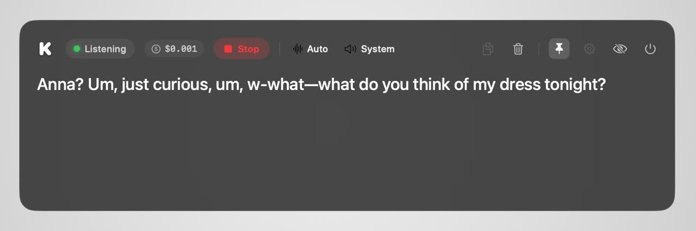

# Korus

Real-time live captions and translation overlay for macOS. Hear any audio playing on your Mac (a YouTube video, a Zoom call, a movie) and see it transcribed — and optionally translated to one of 60+ languages — in a floating panel above every other window.



- Native Swift / SwiftUI, no Electron, no background services
- macOS 14.4+
- Captures system audio, microphone, or both
- Streams to [Soniox](https://soniox.com) (`stt-rt-v4`, ~6% WER, RU first-class)
- Bring your own Soniox API key — pay-as-you-go (~$0.12/hr, ~$0.18/hr with translation)

## Install

### From a release

Download the latest `Korus.zip` from [Releases](https://github.com/Meldren/Korus/releases), unzip, drop into `/Applications`. First launch is ad-hoc signed, so right-click → **Open** to bypass Gatekeeper once.

### From source

```bash
brew install xcodegen
git clone https://github.com/Meldren/Korus.git
cd Korus
xcodegen generate
open Korus.xcodeproj
```

Pick the `Korus` scheme in Xcode and press ⌘R. Approve the **Microphone** prompt on first launch and **Audio Recording** the first time you press Listen.

## First run

1. Open the gear icon → paste your Soniox API key.
2. Pick source / target language and audio source in the toolbar.
3. Click **Listen**. Captions stream as you speak or as audio plays.

The cost chip in the toolbar shows the live session estimate; click it to open the Soniox Console for your real account balance.

## Auto-saved sessions

Every Listen session writes to disk in real time at `~/Library/Application Support/Korus/sessions/<timestamp>/`:

- `original.txt` — raw transcription
- `translation.txt` — present only when translation is on
- `audio.wav` — 16 kHz mono PCM, the same audio sent to Soniox

If Korus crashes mid-stream the files are still on disk with everything captured up to that point. The save folder is configurable in **Settings → Session backup**.

## Pricing

Korus itself is free. All cost goes through Soniox — see [soniox.com/pricing](https://soniox.com/pricing). At the time of writing: ~$0.12/hr transcription, ~$0.18/hr with one-way translation. The toolbar chip is a local estimate; authoritative balance is at [console.soniox.com](https://console.soniox.com).

## License

MIT — see [LICENSE](LICENSE).
